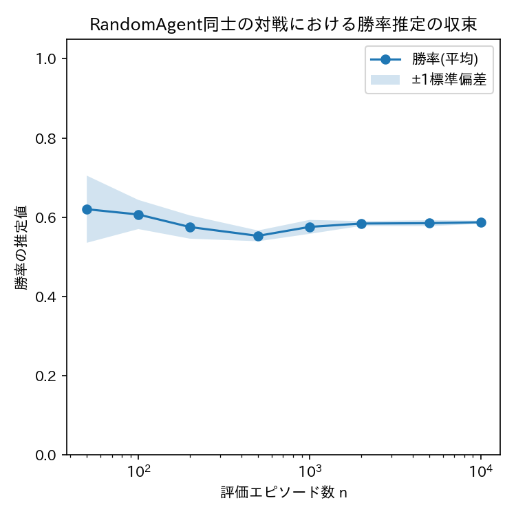

# ex001: 3目並べ環境の実装とランダムプレイによる評価基盤の構築

本ファイルは理論的な解説である．実装は [ex001_random_baseline.ipynb](ex001_random_baseline.ipynb) を参照．

## 0. 強化学習の基礎用語

本教材は，PyTorch等を用いた教師あり深層学習の経験はあるが，強化学習(Reinforcement Learning)は
初めてという学習者を想定している．以降の実験で繰り返し登場する基本用語を，
教師あり学習との対比を交えて先にまとめる．

**環境(environment)とエージェント(agent)**

強化学習では，学習の主体である「エージェント」が「環境」と相互作用しながら学習する．
本教材では，3目並べのゲーム自体(盤面のルールと相手の振る舞い)が環境であり，
先手(X)を選ぶ側が学習エージェントである．
教師あり学習と異なり，エージェントの行動が次に与えられる入力(状態)自体を変化させる点が
本質的な違いである．

**状態(state) $`s`$**

エージェントが観測する，環境の現在の状況を表す情報を状態と呼ぶ．
教師あり学習における「入力データ」に近いが，独立に与えられるミニバッチとは異なり，
状態は行動によって次々と変化していく．
本教材では，3目並べの盤面(9マスそれぞれの状態)がそのまま状態である．

**行動(action) $`a`$**

エージェントが状態に応じて選択する操作を行動と呼ぶ．
教師あり学習における「モデルの出力」に近いが，行動が環境に影響を与え，次の状態を
決定づける点が異なる(教師あり学習の出力は環境を変化させない)．
本教材では，空いているマスに印を置くことが行動である．

**エピソード(episode)**

初期状態から，ゲームが終了する(勝敗または引き分けが決まる)までの状態・行動・報酬の
一連の系列をエピソードと呼ぶ．3目並べにおける「1試合」がエピソードに相当する．

**終端状態(terminal state)と非終端状態(non-terminal state)**

勝敗あるいは引き分けが確定し，それ以上ゲームが続かない状態を終端状態と呼ぶ．
まだ決着していない，ゲームが続く状態を非終端状態と呼ぶ．
方策反復法・価値反復法(ex002・ex003)で状態を数え上げる際は，この非終端状態のみを対象とする．

**報酬(reward) $`r`$**

エージェントが行動した結果として環境から得られるスカラー値を報酬と呼ぶ．
教師あり学習の損失に近い役割を果たすが，損失とは異なり最大化を目指す量であり，
行動の直後には得られず，エピソード終了時にまとめて(あるいは疎に)与えられることが多い．
本教材では，勝ち $`=+1`$，負け $`=-1`$，引き分けおよび非終端の遷移 $`=0`$ という報酬を用いる．

**方策(policy) $`\pi`$**

状態を受け取って行動(または行動の確率分布)を返す関数を方策と呼ぶ．
教師あり学習における「学習済みモデルの推論関数」に近い役割を果たす．
強化学習の目的は，報酬の合計(収益)を最大化する方策を見つけることである．

**割引率(discount factor) $`\gamma`$**

将来得られる報酬を，現在の価値としてどれだけ割り引いて評価するかを表す，0以上1以下の定数．
$`\gamma`$ が1に近いほど将来の報酬を重視し，0に近いほど直近の報酬を重視する．

**状態価値関数 $`V(s)`$ と行動価値関数 $`Q(s,a)`$**

状態 $`s`$ から(あるいは状態 $`s`$ で行動 $`a`$ を取ってから)，方策に従って行動し続けたときに
得られる，割引された報酬の合計(収益)の期待値を，それぞれ状態価値関数・行動価値関数と呼ぶ．
教師あり学習の「予測値」に近いが，正解ラベルが直接与えられるのではなく，ベルマン方程式と
呼ばれる自己無矛盾な再帰的な式によって定義される点が特徴である．
本教材の全実験は，この $`V(s)`$ または $`Q(s,a)`$ を求めることに帰着する．

これ以降に登場する「スイープ」等，個々の実験に固有の用語は，各実験の解説内で改めて説明する．

## 1. 目的

本実験は，3目並べ(Tic-Tac-Toe)を題材とした強化学習の段階的学習教材の第1段階である．
本実験の目的は次の3点である．

- 3目並べの環境をNumPyのみでフルスクラッチ実装すること．
- 以降の全実験(ex002〜ex006)で共通して用いる評価の枠組み(`evaluate`, `play_human_vs_ai`)を構築すること．
- ランダム方策の性能を測定し，以降の全ての学習アルゴリズムの比較基準(ベースライン)を確立すること．

本実験では価値関数の学習は行わず，環境とエージェントの骨格そのものの正しさを検証する．

## 2. 手法

### 2.1 環境・エージェント定義

盤面(状態) $`s`$ は，9マスの目の値を並べたタプル $`s = (c_0, \ldots, c_8)`$ で表す．
$`c_i`$ はマス $`i`$ の状態であり，$`c_i \in \{0, 1, 2\}`$ はそれぞれ空マス，先手(X，学習エージェント)，
後手(O)を表す．
行動 $`a`$ は「どのマスに印を置くか」であり，行動空間は $`a \in \{0, \ldots, 8\}`$ である．
ただし，既に印が置かれたマスは選べないため，$`c_a = 0`$ (そのマスが空)を満たす行動のみが
合法手である．

本教材では，学習エージェントは常に先手(X)とする．
後手(O)は，合法手から一様ランダムに1手を選択する固定方策 $`\pi_{\mathrm{opp}}`$ に従うとみなす．
すなわち，環境は「ゲーム規則」と「固定された相手の方策」の両方を含む．
このように定式化すると，エージェントから見て「次に何が起こるか」は現在の状態 $`s`$ と
自分の行動 $`a`$ だけで決まる(過去の手順によらない)．
この性質をマルコフ性と呼び，このような問題をマルコフ決定過程(Markov Decision Process, MDP)と呼ぶ．

MDPでは，状態 $`s`$ で行動 $`a`$ を取ったときに次の状態 $`s'`$ に移る確率(遷移確率) $`p(s'\mid s,a)`$ が
定義される．本教材では，後手の方策 $`\pi_{\mathrm{opp}}`$ が一様ランダムという既知の分布であるため，
この遷移確率をゲーム規則から解析的に計算できる．

$$
p(s' \mid s, a) = \sum_{a_{\mathrm{opp}}} \pi_{\mathrm{opp}}(a_{\mathrm{opp}} \mid s_{\mathrm{mid}}) \; \mathbb{1}\!\left[ s' = f(s_{\mathrm{mid}}, a_{\mathrm{opp}}) \right]
$$

右辺は，「後手が取りうる各行動 $`a_{\mathrm{opp}}`$ について，それが選ばれる確率
$`\pi_{\mathrm{opp}}(a_{\mathrm{opp}}\mid s_{\mathrm{mid}})`$ と，実際にその行動によって $`s'`$ に
到達するかどうか($`\mathbb{1}[\cdot]`$，成り立てば1・成り立たなければ0)を掛けて足し合わせる」
という意味である．ここで $`s_{\mathrm{mid}}`$ はエージェントが行動 $`a`$ を選択した直後
(後手が行動する前)の盤面，$`f`$ は盤面遷移関数(現在の盤面と行動から次の盤面を計算する関数)である．
この既知の遷移確率(環境モデル)は，ex002・ex003の動的計画法で用いる．

報酬 $`r`$ は，エージェント(X)が勝った場合 $`r=+1`$，負けた場合 $`r=-1`$，引き分けの場合 $`r=0`$，
非終端の遷移(まだ決着していない場合)では $`r=0`$ とする．

### 2.2 本実験で用いる方策

本実験のエージェントは合法手から一様ランダムに行動を選択する `RandomAgent` のみであり，
価値関数やQ関数の更新は行わない．

### 2.3 評価指標

対戦成績は，勝率 $`\hat{p}_{\mathrm{win}}`$，引き分け率 $`\hat{p}_{\mathrm{draw}}`$，敗率 $`\hat{p}_{\mathrm{lose}}`$
の3指標とし，$`n`$ 回対戦した際の頻度として推定する．

$$
\hat{p}_{\mathrm{win}} = \frac{1}{n}\sum_{k=1}^{n} \mathbb{1}[k \text{回目の対戦で勝利}]
$$

$`n`$ が小さいほど推定値の分散は大きく，$`n \to \infty`$ で真の勝率に収束する．
本実験では評価エピソード数 $`n`$ を増やしながら勝率推定値の収束の様子を確認する．

## 3. 実験条件

| 項目 | 値 |
| :--- | :--- |
| 環境 | 3目並べ(先手Xがエージェント，後手Oは一様ランダム方策) |
| 割引率 $`\gamma`$ | 本実験では価値関数を学習しないため未使用 |
| 評価エピソード数の系列 | 50, 100, 200, 500, 1000, 2000, 5000, 10000 |
| 最終評価エピソード数 | 1000 |
| シード | 0, 1, 2 |
| 結果の保存先 | `outputs/ex001_tictactoe_baseline/RandomAgent/seed_{k}/` |

### 実験前に考える

1. 先手(X)が完全に最適な戦略を取り，後手(O)が一様ランダムに手を選ぶ場合，Xの勝率・引き分け率・敗率はそれぞれどの程度になると予想するか．根拠も述べよ．
2. 両者ともに一様ランダムに手を選ぶ場合，Xの勝率とOの勝率は同じになるか，それとも異なるか．異なるとすればどちらが有利か，理由とともに予想せよ．
3. 評価エピソード数 $`n`$ を増やすと，勝率推定値のばらつき(シード間の標準偏差)はどのように変化すると予想するか．

## 4. 実験結果

予想を書いてから開いてください

到達可能な状態数は，全終端状態を含めて5,478，Xの手番かつ非終端の状態は2,423であった．
評価エピソード数を50〜10,000まで変化させた際の勝率推定値の収束は下図の通りである．

最終評価(n=1000，3シード平均±標準偏差)は次の通りである．

| 指標 | 値 |
| :--- | ---: |
| 勝率 | 0.583 ± 0.020 |
| 引き分け率 | 0.121 ± 0.011 |
| 敗率 | 0.296 ± 0.018 |

### 実験後に考える

1. 実際に得られた勝率・引き分け率・敗率は，実験前の予想と一致していたか．一致しない場合，何が原因と考えられるか．
2. 3目並べは先手・後手ともに最適に打てば必ず引き分けになることが知られている(ゲーム理論的に「解けている」)．一方の対戦相手がランダムである場合，先手が引き分けではなく高い確率で勝利できるのはなぜか．手数の観点から説明せよ．
3. 勝率推定値の標準偏差は，評価エピソード数 $`n`$ に対してどのようなオーダーで減少していたか(グラフのx軸は対数スケールであることに注意せよ)．

## 5. 考察

考察の例を見る前に，自分の考察を書いてください

一様ランダムな相手に対しては，先手であるという有利さだけでも高い勝率が得られる．
しかし，これは「ランダムな相手に対する優位性」に過ぎない．
ex002以降で学習する最適方策には通用しない．

評価エピソード数 $`n`$ が小さいと，勝率推定値の分散が大きくなる．
シードによって見かけ上の性能に差が生じるためである．
そのため学習アルゴリズムを比較する際には，十分な評価エピソード数(本教材では1000)と
複数シードでの平均・標準偏差の報告が欠かせない．
この知見が，ex002以降の評価基盤の妥当性を裏付けている．

## 6. まとめ

- 3目並べの環境をNumPyのみでフルスクラッチ実装し，到達可能な状態数が5,478(うちXの手番かつ非終端が2,423)であることを確認した．
- 全実験で共通して用いる`evaluate`と`play_human_vs_ai`の枠組みを構築した．
- ランダム方策同士の対戦における勝率をベースラインとして記録し，以降の学習アルゴリズムの性能向上を測る基準を確立した．
- 評価エピソード数と勝率推定値の分散の関係を確認し，以降の実験で1000エピソード・3シードによる評価を採用する根拠を得た．

## 7. 発展課題

**課題**: 後手(O)がランダムではなく，「勝てる手があれば必ず勝つ・負けそうな手があれば防ぐ・それ以外はランダム」という
簡易的なルールベース方策を取るように`TicTacToeEnv.step`の後手の行動選択部分を変更し，
先手(ランダム方策)の勝率・引き分け率・敗率がどのように変化するかを比較せよ．

**比較する対象**: 一様ランダムな後手 vs ルールベースの後手，それぞれに対する先手(ランダム方策)の成績．

**予想**: ルールベースの後手に対して先手の勝率はどう変化するか，引き分け率はどう変化するかを予想せよ．

回答例を見る

ルールベースの後手は，勝てる手を逃さず，負けを積極的に防ぐため，先手がランダムに打つ場合，
先手の勝率は一様ランダムな後手に対するときよりも大幅に低下し，引き分け率が上昇することが期待される．
これは，後手の方策の「強さ」が変わるとエージェントから見た環境モデル $`p(s'\mid s,a)`$ 自体が変化することを意味し，
ex002以降で学習する方策は「どのような相手を仮定するか」に依存することを示唆する重要な発展的論点である．

