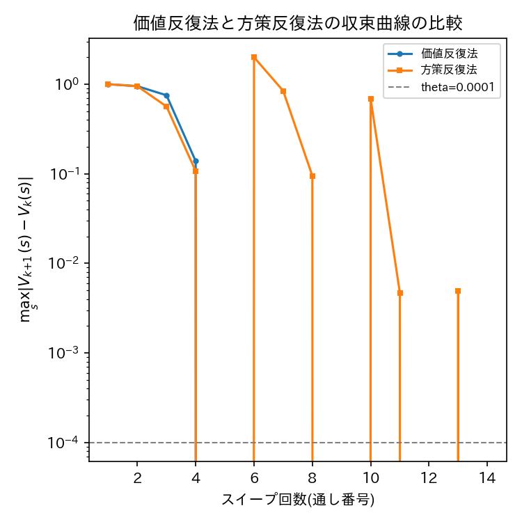

# ex003: 完全な環境モデルを用いた動的計画法2 — 価値反復法(Value Iteration)と方策反復法との収束性比較

本ファイルは理論的な解説である．実装は [ex003_value_iteration.ipynb](ex003_value_iteration.ipynb) を参照．

## 1. 目的

本実験は，強化学習教材の第3段階である．ex002では方策評価と方策改善を交互に繰り返す
方策反復法を実装した．本実験では，同じ既知の環境モデルを用いつつ，方策評価と方策改善を
明示的に分離せず，ベルマン最適方程式によって価値関数を直接最適化する価値反復法
(Value Iteration)を実装する．ex002との主な差分は，方策評価を収束するまで内側ループで
繰り返す代わりに，各スイープで即座に $ \max $ を取って価値関数を更新する点のみであり，
それ以外の環境・評価の枠組みはex002と同一である．
本実験ではさらに，ex002(方策反復法)の結果を読み込み，収束に要する反復回数(計算量)と
最終的に得られる価値関数・方策を比較することで，2つの動的計画法の理論的な違いを実証的に確認する．

## 2. 手法

### 2.1 環境・エージェント定義

状態・行動空間・環境モデル(`TicTacToeEnv.transition_model`)はex001・ex002と同一である．

### 2.2 目的関数・更新式

価値反復法は，ベルマン最適方程式

$$
V_{k+1}(s) = \max_{a} \sum_{s'} p(s' \mid s, a) \Big[ r(s,a,s') + \gamma \, V_k(s') \Big]
$$

を，$ \max_s |V_{k+1}(s) - V_k(s)| < \theta $ となるまで反復して用いる．
方策反復法(ex002)が「固定した方策のもとでの評価が収束するまで待ってから改善する」のに対し，
価値反復法は「1スイープごとに $ \max_a $ を取ることで評価と改善を同時に行う」という違いがある．
収束後の価値関数から，ex002と同様に

$$
\pi^{*}(s) = \arg\max_{a} \sum_{s'} p(s'\mid s,a)\big[r(s,a,s') + \gamma V(s')\big]
$$

によって最適方策を抽出する．コード上では，`value_iteration`関数内の`new_V[s]`が上式の
$ V_{k+1}(s) $ に，`best_q`の計算が $ \max_a(\cdot) $ に対応する．

### 2.3 評価指標

ex002と同様に，各スイープの $ \max_s |V_{k+1}(s)-V_k(s)| $ を収束曲線として用いる．
加えて，本実験ではex002の収束曲線を読み込み，同一グラフ上に重ねて表示することで
収束に要するスイープ数を直接比較する．最終的な方策の強さは`evaluate`による
対ランダム方策の勝率・引き分け率・敗率で測る．

## 3. 実験条件

| 項目 | 値 | 備考 |
| :--- | :--- | :--- |
| 環境 | 3目並べ(先手Xがエージェント，後手Oは一様ランダム方策) | ex001, ex002と共通 |
| 割引率 $ \gamma $ | 0.95 | ex002と同一条件で比較するため揃える |
| 収束判定閾値 $ \theta $ | 1e-4 | ex002と同一 |
| シード | 0, 1, 2 | 価値反復法は $ V $ の初期値を常に0とするため理論上シードに依存しないが，実験ループの構造をex002と揃え，かつ結果がシードによらず一致することを確認する目的で同じ3シードを実行する |
| 結果の保存先 | `outputs/ex003_tictactoe_dp/ValueIteration/gamma0.95_theta0.0001/seed_{k}/` | |

### 実験前に考える

1. 価値反復法と方策反復法は，最終的に同じ最適価値関数・最適方策に収束すると予想するか．
2. 価値反復法に必要な「スイープ回数」は，方策反復法の「(内側ループを含めた)総スイープ回数」と比べて多いと予想するか，少ないと予想するか．
3. 1回のスイープあたりの計算量は，方策反復法の方策評価の1スイープと比べて同じか，異なるか．

## 4. 実験結果

予想を書いてから開いてください

価値反復法は5スイープで収束し，方策反復法(ex002)の14〜15スイープより少ないスイープ数で
収束した．両手法の収束曲線を重ねたグラフは下図の通りである．

両手法のQ値の最大差は $ 0.000000 $ であり，完全に一致した．
最終評価(n=1000，3シード平均±標準偏差)は次の通りであり，ex002の方策反復法と同一であった．

| 指標 | 値 |
| :--- | ---: |
| 勝率 | 0.996 ± 0.002 |
| 引き分け率 | 0.004 ± 0.002 |
| 敗率 | 0.000 ± 0.000 |

### 実験後に考える

1. 価値反復法と方策反復法のQ値の最大差はどの程度だったか．理論的に両者が同一の最適解に収束するはずであることと結びつけて解釈せよ．
2. 収束曲線を比較すると，スイープ数はどちらが少なかったか．方策反復法は方策評価が「収束するまで」実行される一方，価値反復法は $ \max $ を取るだけで済むという性質の違いから，この結果を説明せよ．
3. 状態数が本実験よりもはるかに多い問題(例えば囲碁やチェス)に動的計画法を適用しようとした場合，どのような困難が生じると考えられるか．

## 5. 考察

考察の例を見る前に，自分の考察を書いてください

価値反復法と方策反復法は，いずれもベルマン方程式に基づく動的計画法であり，
有限MDPにおいて同一の最適価値関数・最適方策に収束することが理論的に保証されている．
本実験でQ値の最大差がほぼ0であったことは，この理論的性質と整合する結果である．
一方で，両手法の反復構造には明確な違いがある．方策反復法は，固定した方策のもとでの
方策評価が収束するまで内側ループを回すため，外側の改善回数自体は少ないものの，
1回の改善につき複数回のスイープを要する．価値反復法は，評価の収束を待たずに
$ \max_a $ を取ることで改善を先取りするため，外側・内側の区別がなく，
1スイープあたりの計算はやや重い(全行動のQ値を計算する)ものの，
全体として比較的少ないスイープ数で収束する傾向がある．
いずれの手法も，計算量が状態数と行動数の積に比例するため，
状態空間が本実験(2,423状態)よりもはるかに大きい問題では，
全状態を陽に反復すること自体が非現実的になる．この限界が，
サンプルされた経験のみから学習するモデルフリー手法(ex004・ex005)の必要性を動機づける．

## 6. まとめ

- 価値反復法を実装し，ex002の方策反復法と同一の最適価値関数・最適方策に収束することを確認した．
- 2つの動的計画法の収束曲線・スイープ数を比較し，方策評価と方策改善を分離するか一体化するかという構造上の違いが計算過程に与える影響を確認した．
- いずれの手法も既知の環境モデルと全状態の反復を前提としており，状態数が大きい問題への拡張には限界があることを述べた．
- この限界が，ex004以降で扱うモデルフリー手法を導入する動機であることを整理した．

## 7. 発展課題

**課題**: 収束判定閾値 $ \theta $ を $ \{10^{-2}, 10^{-3}, 10^{-4}, 10^{-6}\} $ と変化させ，
価値反復法の収束に要するスイープ数と，収束後の方策の対ランダム方策の勝率がどう変化するかを調べよ．

**比較する対象**: 各 $ \theta $ における(a)収束に要したスイープ数，(b)最終的な勝率・引き分け率・敗率．

**予想**: $ \theta $ を大きくする(収束判定を緩める)と，スイープ数と勝率はそれぞれどう変化するかを予想せよ．

回答例を見る

$ \theta $ を大きくするほど，早い段階で収束条件を満たすためスイープ数は減少する．
一方で，価値関数が真の最適値に十分近づく前に反復を打ち切ることになるため，
方策の抽出(1手先読みのargmax)がわずかに不正確になり得るが，
3目並べ程度の単純な問題では行動間の価値差が比較的明確であるため，
$ \theta $ をある程度緩めても最終的な方策自体は変化せず，勝率もほぼ変化しないことが多い．
この結果は，問題の構造(行動間の価値差の大きさ)によって，
計算コストと精度のトレードオフが実質的に無視できる場合とそうでない場合があることを示唆する．

