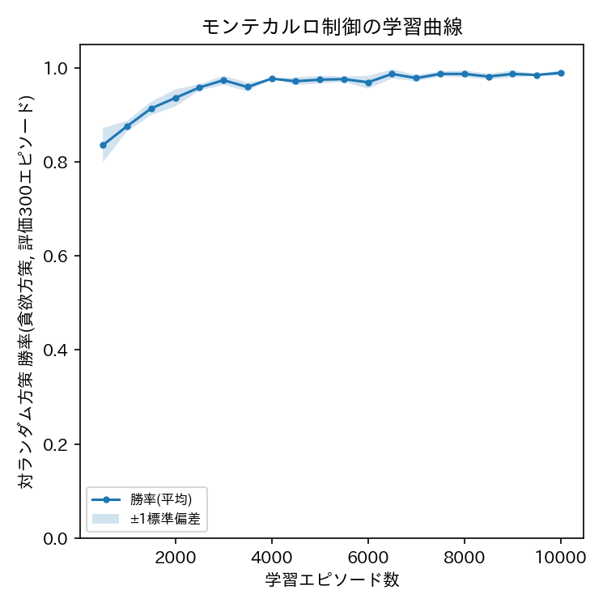

# ex004: 環境モデル不明を想定したモデルフリー学習1 — モンテカルロ制御(Monte Carlo Control)

本ファイルは理論的な解説である．実装は [ex004_monte_carlo.ipynb](ex004_monte_carlo.ipynb) を参照．

## 1. 目的

本実験は，強化学習教材の第4段階である．ex002・ex003では，後手の方策(一様ランダム)が
既知であるという前提のもとで，環境モデル $`p(s'\mid s,a)`$ を直接用いる動的計画法を実装した．
しかし，実際の多くの強化学習の応用では，環境の遷移確率をあらかじめ知ることはできない．
本実験では，環境モデルを一切用いず，エージェントが実際に環境とサンプルエピソードを
生成しながら経験のみから行動価値関数を学習するモンテカルロ制御(Monte Carlo Control)を実装する．
ex002・ex003との主な差分は，全状態を一括で更新するのではなく，
サンプリングされたエピソードの収益からのみ $`Q(s,a)`$ を推定する点である．

## 2. 手法

### 2.1 環境・エージェント定義

状態・行動空間はex001〜ex003と同一である．
本実験では，`TicTacToeEnv.transition_model`(既知の環境モデル)は使用しない．
代わりに，`TicTacToeEnv.step`によって実際に後手(固定ランダム方策)と対戦しながら
1エピソード分のデータ $`(s_0, a_0, r_1, s_1, a_1, r_2, \ldots, s_{T-1}, a_{T-1}, r_T)`$ を生成し，
これだけを学習に用いる．ここで $`T`$ はそのエピソードの長さ(手数)である．
以下では，ある状態 $`s`$ である行動 $`a`$ を取ったという組を「状態行動対 $`(s,a)`$」と呼ぶ．

行動選択には $`\epsilon`$-greedy方策を用いる．確率 $`\epsilon`$ で合法手から一様ランダムに行動し，
確率 $`1-\epsilon`$ で現在の $`Q(s,a)`$ が最大となる行動を選択する．
教師あり学習では入力に対する出力を1通りに決めればよいが，強化学習では自分で試行錯誤して
データ(エピソード)を集める必要がある．そのため，既に良いと分かっている行動を選び続ける
「活用(exploitation)」と，まだ試していない行動を試す「探索(exploration)」のバランスを
取る仕組みが必要であり，$`\epsilon`$-greedy方策はその最も単純な実現方法である．

### 2.2 目的関数・更新式

エピソード内の時刻 $`t`$ (そのエピソードの中で何手目かを表す添字)における収益(収益,
その時点から終了までに得られる割引累積報酬)は

$$
G_t = \sum_{k=0}^{T-t-1} \gamma^{k} r_{t+k+1}
$$

と定義される．右辺は，「$`t`$ の1手先で得る報酬 $`r_{t+1}`$ に，2手先の報酬 $`r_{t+2}`$ を
$`\gamma`$ 倍したもの，3手先の報酬を $`\gamma^2`$ 倍したもの，…をエピソード終了(時刻 $`T`$)まで
すべて足し合わせる」という意味であり，ex001の割引率 $`\gamma`$ がここで使われる．

初回訪問モンテカルロ法(first-visit MC)では，各エピソード内で状態行動対 $`(s,a)`$ が
初めて出現した時刻 $`t`$ の収益 $`G_t`$ のみを用いる．
そして，何エピソードにもわたって観測したその収益の標本平均によって $`Q(s,a)`$ を更新する．

$$
Q(s,a) \leftarrow \frac{1}{N(s,a)} \sum_{i=1}^{N(s,a)} G_t^{(i)}
$$

ここで $`N(s,a)`$ は $`(s,a)`$ が(これまでの全エピソードを通じて)初回訪問された回数，
$`G_t^{(i)}`$ はその$`i`$回目の訪問で観測された収益である．
つまり，$`Q(s,a)`$ を「実際にその行動を取った後どれだけの収益が得られたか」の平均値として
推定していることになる．
コード上では，`returns_sum[(s,a)]`が上式の分子($`G_t`$の総和)，`returns_cnt[(s,a)]`が
$`N(s,a)`$に，`Q[(s,a)]`が更新後の標本平均に対応する．

このように，モンテカルロ法は「実際に得られたエピソード全体の収益」という
バイアスのないサンプルから $`Q(s,a)`$ を直接推定する．
これは，1手先だけの期待値を使って計算する動的計画法(ex002・ex003)とは本質的に異なる方法である．

### 2.3 評価指標

学習の進行度は，一定エピソード数ごとに現在の $`Q`$ から貪欲方策を抽出し，
`evaluate`関数で測定した対ランダム方策の勝率の推移(学習曲線)で評価する．
最終的な方策の強さは，学習終了後の $`Q`$ から抽出した貪欲方策の勝率・引き分け率・敗率で測る．

## 3. 実験条件

| 項目 | 値 |
| :--- | :--- |
| 環境 | 3目並べ(ex001〜ex003と共通．ただしモデルは使用しない) |
| 割引率 $`\gamma`$ | 0.95(ex002・ex003と同一) |
| 探索率 $`\epsilon`$ | 0.1 |
| 学習エピソード数 | 10,000 |
| 評価間隔 | 500エピソードごと(評価は300エピソード) |
| 最終評価エピソード数 | 1,000 |
| シード | 0, 1, 2 |
| 結果の保存先 | `outputs/ex004_tictactoe_mc/MonteCarloControl/gamma0.95_epsilon0.1/seed_{k}/` |

- $`\epsilon`$: 固定相手に対する探索と活用のバランスを取るための標準的な値．
- 学習エピソード数: 到達可能な状態行動対の訪問回数を十分に確保するため．
- 評価間隔: 学習曲線を追跡しつつ計算コストを抑えるため．

### 実験前に考える

1. 動的計画法(ex002・ex003)は数スイープ(状態数×行動数のオーダーの計算)で最適方策に収束した．モンテカルロ法が同等の強さに達するには，何エピソード程度の学習が必要になると予想するか．
2. $`\epsilon`$-greedy方策において $`\epsilon`$ を大きくしすぎる，または小さくしすぎると，それぞれどのような問題が生じると予想するか．
3. 動的計画法とモンテカルロ法は，最終的に同じ最適方策に収束すると予想するか．収束するとすれば，それはなぜか．

## 4. 実験結果

予想を書いてから開いてください

学習エピソード数に対する勝率の学習曲線(3シード平均±標準偏差)は下図の通りである．

10,000エピソード学習後の最終評価(n=1000，3シード平均±標準偏差，学習時間は3シード平均約1.3秒)は
次の通りである．

| 指標 | 値 |
| :--- | ---: |
| 勝率 | 0.984 ± 0.006 |
| 引き分け率 | 0.014 ± 0.005 |
| 敗率 | 0.002 ± 0.001 |

### 実験後に考える

1. 動的計画法(ex002・ex003)の収束に要した「スイープ数」と，モンテカルロ法が同等の勝率に達するまでに要した「エピソード数」を比較せよ．両者は単位が異なる(スイープは全状態の一括更新，エピソードは1回のゲームの経験)ことに注意しつつ，データ効率の違いについて考察せよ．
2. 学習曲線には序盤にどのような特徴が見られたか．$`\epsilon`$-greedy方策による探索の影響と結びつけて説明せよ．
3. 最終的に得られた勝率は，ex002・ex003の動的計画法による最適方策の勝率とどの程度近かったか．

## 5. 考察

考察の例を見る前に，自分の考察を書いてください

モンテカルロ法は環境モデルを必要としない．
その代わり，方策を評価するために実際に多数のエピソードをサンプリングする必要があり，
動的計画法よりはるかに多くのデータ(エピソード数)を要する．
これは，モンテカルロ法が「エピソード全体の実現値」という分散の大きいサンプルから
価値を推定するのに対し，動的計画法は既知の遷移確率に基づく厳密な期待値計算を
行うためである．

一方で，モンテカルロ法には利点もある．
環境モデルが未知の問題や，状態数が膨大で動的計画法が適用できない問題にも使える．

本実験のように，同一の最適方策に(漸近的に)収束することが期待される設定で
両手法を比較すると，強化学習における基本的なトレードオフが具体的に確認できる．
モデルベース手法はデータ効率に優れるが，環境モデルの既知性を要求する．
モデルフリー手法は汎用性に優れるが，データ効率で劣る．

## 6. まとめ

- 環境モデルを一切用いず，サンプルエピソードの収益のみからQ(s,a)を学習するモンテカルロ制御を実装した．
- $`\epsilon`$-greedy方策による探索と活用のバランスを導入し，学習曲線を通じてその効果を確認した．
- 動的計画法と比較して，同等の勝率に到達するまでにはるかに多くのエピソード数を要することを確認し，モデルベース手法とモデルフリー手法のデータ効率のトレードオフを実証した．
- 最終的な勝率は動的計画法の最適方策に近い値まで到達し，モンテカルロ法が漸近的に最適方策へ収束することを確認した．

## 7. 発展課題

**課題**: 探索率 $`\epsilon \in \{0.01, 0.1, 0.3\}`$ を変化させてモンテカルロ制御を再実行し，
学習曲線(勝率の立ち上がりの速さ・最終的な勝率)を比較せよ．

**比較する対象**: 各 $`\epsilon`$ における学習曲線の形状と，10,000エピソード終了時点の最終評価．

**予想**: $`\epsilon`$ が大きい場合と小さい場合で，学習序盤・終盤の勝率はそれぞれどう変化するかを予想せよ．

回答例を見る

$`\epsilon`$ が大きすぎる場合，学習が進んでもランダムな行動を取る頻度が高いままであるため，
評価時の(貪欲方策としての)最終的な勝率自体には大きく影響しないことが多いが，
探索に伴う「無駄な負け」を経験する頻度が学習中一貫して高くなる．
$`\epsilon`$ が小さすぎる場合，学習初期に有望な行動を見つけられないまま
特定の行動に偏って収束してしまい(局所的な準最適解に留まり)，最終的な勝率が
動的計画法による真の最適方策に到達しない場合がある．
このトレードオフは，$`\epsilon`$ を学習の進行とともに徐々に減衰させる
「$`\epsilon`$-減衰(epsilon decay)」という一般的な工夫の動機となっている．

