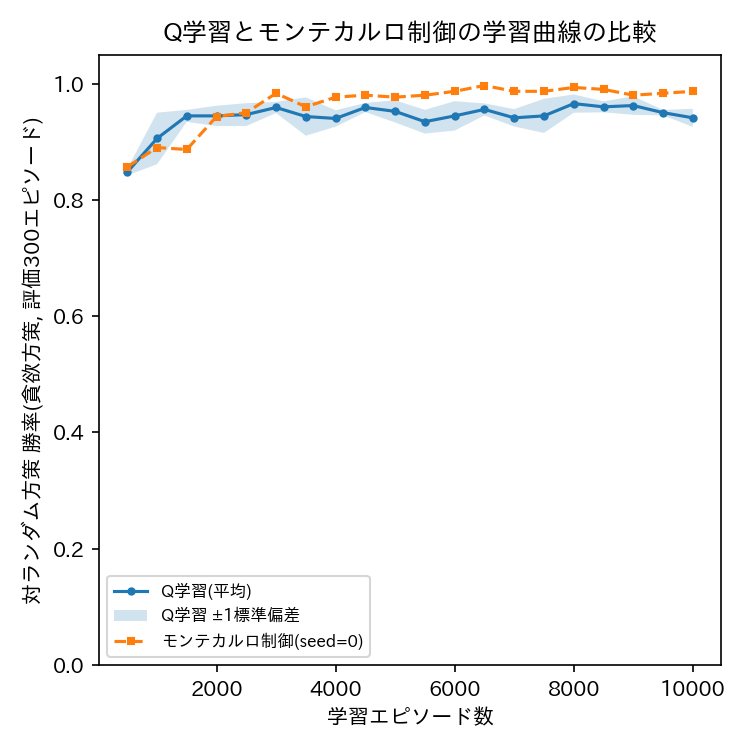

# ex005: TD学習によるモデルフリーオフ方策学習 — Q学習(Q-Learning)

本ファイルは理論的な解説である．実装は [ex005_q_learning.ipynb](ex005_q_learning.ipynb) を参照．

## 1. 目的

本実験は，強化学習教材の第5段階であり，動的計画法(ex002・ex003)からモンテカルロ法(ex004)を
経て，Temporal Difference学習(TD学習)の代表的手法であるQ学習(Q-Learning)へと至る最終段階である．
ex004のモンテカルロ制御は，1エピソードが終了して初めて収益 $ G_t $ が確定し，
Q(s,a)を更新できるという制約があった．本実験のQ学習は，エピソードの終了を待たず，
1ステップの遷移が得られるたびに，次状態における価値の推定値を用いて即座にQ(s,a)を更新する
(ブートストラップする)．ex004との主な差分は，この「1ステップごとの更新」の1点のみであり，
環境・評価の枠組みはex001〜ex004と共通である．

## 2. 手法

### 2.1 環境・エージェント定義

状態・行動空間・環境(`TicTacToeEnv.step`による実サンプリング)はex004と同一である．
行動選択にはex004と同様に $ \epsilon $-greedy方策を用いる．

### 2.2 目的関数・更新式

Q学習は，1回の遷移 $ (s_t, a_t, r_{t+1}, s_{t+1}) $ が得られるたびに，以下のTD誤差

$$
\delta_t = r_{t+1} + \gamma \max_{a'} Q(s_{t+1}, a') - Q(s_t, a_t)
$$

を用いて，学習率 $ \alpha \in (0,1] $ で

$$
Q(s_t, a_t) \leftarrow Q(s_t, a_t) + \alpha \, \delta_t
$$

と更新する．エピソードが $ s_t $ で終了する場合は $ \max_{a'} Q(s_{t+1}, a') $ の項を0として扱う．
$ \max_{a'} Q(s_{t+1}, a') $ は，実際に次状態で選択した行動 $ a_{t+1} $ に依存せず，
「次状態で最善の行動を取った場合」の価値を用いる点で off-policy(方策外)の手法である．
行動選択に用いる方策( $ \epsilon $-greedy，探索を含む)と，更新に用いる方策(貪欲，$ \max $)が
異なることが，モンテカルロ制御(on-policy)との理論的な違いである．
コード上では，`target`が $ r_{t+1} + \gamma \max_{a'} Q(s_{t+1},a') $ に，
`alpha * (target - Q[(state, action)])`が上式の更新量 $ \alpha \delta_t $ に対応する．

### 2.3 評価指標

ex004と同様に，一定エピソード数ごとの貪欲方策の勝率推移(学習曲線)と，
学習終了後の最終評価(勝率・引き分け率・敗率)を用いる．

## 3. 実験条件

| 項目 | 値 | 備考 |
| :--- | :--- | :--- |
| 環境 | 3目並べ(先手Xがエージェント，後手Oは一様ランダム方策) | ex001〜ex004と共通 |
| 割引率 $ \gamma $ | 0.95 | ex002〜ex004と同一 |
| 探索率 $ \epsilon $ | 0.1 | ex004と同一 |
| 学習率 $ \alpha $ | 0.1 | テーブル型TD学習における標準的な初期値 |
| 学習エピソード数 | 50,000 | ex004と比較可能にするため同一 |
| 評価間隔 | 2,000エピソードごと(評価は300エピソード) | ex004と同一 |
| 最終評価エピソード数 | 1,000 | ex001〜ex004と同一 |
| シード | 0, 1, 2 | |
| 結果の保存先 | `outputs/ex005_tictactoe_td/QLearning/gamma0.95_alpha0.1_epsilon0.1/seed_{k}/` | |

### 実験前に考える

1. Q学習はエピソード終了を待たずに毎ステップ更新を行う．モンテカルロ法(ex004)と比較して，同じ学習エピソード数でより速く学習が進む(学習曲線の立ち上がりが速い)と予想するか．
2. Q学習は「次状態で最善の行動を取った場合」を仮定して更新するが，実際の行動選択は $ \epsilon $-greedy(探索を含む)である．この違い(off-policyの性質)は，最終的に学習される $ Q(s,a) $ にどのような影響を与えると予想するか．
3. 学習率 $ \alpha $ を大きくしすぎた場合，学習曲線にどのような変化が生じると予想するか．

## 4. 実験結果

予想を書いてから開いてください

Q学習の学習曲線(3シード平均±標準偏差)と，ex004(モンテカルロ制御，seed=0)の学習曲線を
重ねたグラフは下図の通りである．

50,000エピソード学習後の最終評価(n=1000，3シード平均±標準偏差，学習時間は3シード平均約5.8秒)は
次の通りである．

| 指標 | 値 |
| :--- | ---: |
| 勝率 | 0.981 ± 0.004 |
| 引き分け率 | 0.019 ± 0.004 |
| 敗率 | 0.000 ± 0.000 |

### 実験後に考える

1. 同じ学習エピソード数(50,000)において，Q学習とモンテカルロ制御のどちらが速く高い勝率に到達したか．1ステップごとの更新(TD学習)とエピソード終了後の更新(モンテカルロ法)の違いと結びつけて説明せよ．
2. 最終的な勝率は，動的計画法(ex002・ex003)による最適方策の勝率とどの程度近かったか．Q学習・モンテカルロ法・動的計画法の3手法の関係を整理せよ．
3. 本実験と ex004 は，探索率 $ \epsilon $ ・割引率 $ \gamma $ ・学習エピソード数を揃えている．それでもなお学習曲線に差が生じる理由を，「1エピソード内で何回パラメータが更新されるか」という観点から説明せよ．

## 5. 考察

考察の例を見る前に，自分の考察を書いてください

Q学習はTD誤差を用いてステップごとにQ(s,a)を更新するため，1エピソードあたりの更新回数が
モンテカルロ法よりも多く，またモンテカルロ法のように収益が確定するまで待つ必要がないため，
一般に同じエピソード数でより速く学習が進む傾向がある．一方で，TD学習は
$ \max_{a'}Q(s_{t+1},a') $ という「まだ学習途上の推定値」をブートストラップに用いるため，
学習初期には推定誤差が伝播しやすいという特性もある．
動的計画法(ex002・ex003)・モンテカルロ法(ex004)・Q学習(本実験)は，いずれも
同一のベルマン方程式に由来する枠組みに基づいており，理論上は同一の最適方策に収束する．
違いは「環境モデルを使うか(動的計画法)，実際のサンプルのみを使うか(モンテカルロ法・Q学習)」，
および「エピソード全体の収益を使うか(モンテカルロ法)，1ステップごとにブートストラップするか
(Q学習)」という2つの軸に整理できる．この整理は，本教材全体を通じた強化学習の基礎的な
分類体系そのものである．

## 6. まとめ

- TD誤差に基づき1ステップごとにQ(s,a)を更新するQ学習を実装した．
- ex004のモンテカルロ制御と同一の環境・ハイパーパラメータ(学習エピソード数等)のもとで学習曲線を比較し，TD学習がより速く学習が進む傾向を確認した．
- 動的計画法・モンテカルロ法・Q学習の3手法を，環境モデルの要否とブートストラップの有無という2軸で整理した．
- 本教材で扱った基礎的な強化学習手法の系列(ランダムプレイ→動的計画法→モンテカルロ法→Q学習)を完成させた．

## 7. 発展課題

**課題**: 学習率 $ \alpha \in \{0.01, 0.1, 0.5\} $ を変化させてQ学習を再実行し，学習曲線の
立ち上がりの速さと安定性(学習曲線の変動の大きさ)を比較せよ．

**比較する対象**: 各 $ \alpha $ における学習曲線の形状と，50,000エピソード終了時点の最終評価．

**予想**: $ \alpha $ を大きくすると学習は速く進むか，それとも不安定になるかを予想せよ．

回答例を見る

$ \alpha $ が大きいと，1回の更新で $ Q(s,a) $ が大きく変化するため学習序盤の立ち上がりは
速くなり得るが，直近の(ノイズを含む)経験に過剰に適合しやすくなり，学習曲線が振動する
(勝率が安定しない)傾向が強くなる．$ \alpha $ が小さいと，更新は安定するが
真の値に収束するまでに要するエピソード数が増加する．この $ \alpha $ に関するトレードオフは，
ニューラルネットワークの学習率の役割と類似しており，テーブル型強化学習から
関数近似を用いる深層強化学習へ発展させる際にも共通する基礎的な論点である．

