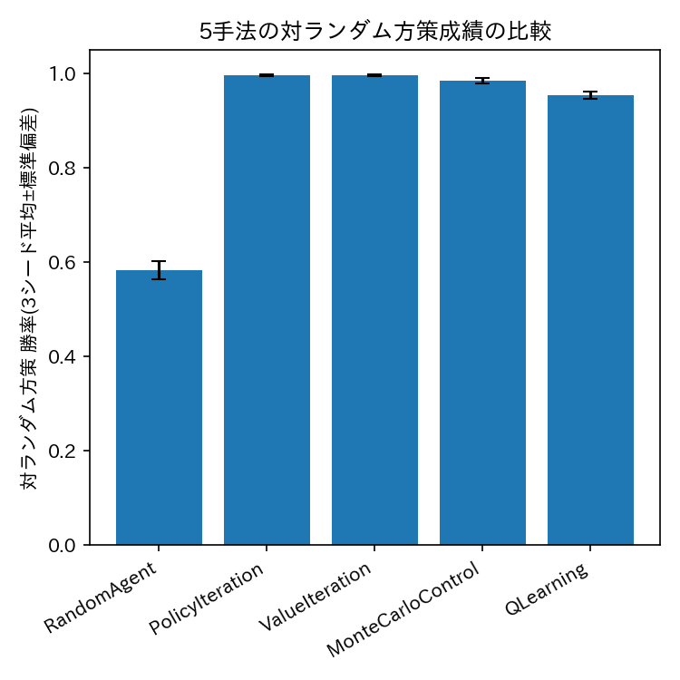
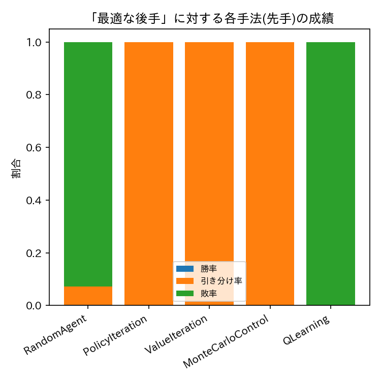

# ex006: 各手法の学習効率・対戦強度の総合比較と対人対戦(Human vs AI)

本ファイルは理論的な解説である．実装は [ex006_comparison_and_play.ipynb](ex006_comparison_and_play.ipynb) を参照．

## 1. 目的

本実験は，強化学習教材の最終段階である．
ex001〜ex005では，ランダム方策・方策反復法・価値反復法・モンテカルロ制御・Q学習を
順に実装し，各手法単体での挙動を確認してきた．
本実験では，これら5手法を保存済みの学習結果(`outputs/`以下のQ値テーブル)から読み込み，
次の3点を実装する．

- 対ランダム方策の勝率・学習に要した計算資源を横並びで比較する表．
- 「一様ランダムな先手(X)に対して最適に打つ後手(O)」を本実験内で新たに計算し，この最も手強い相手に対する各手法の頑健性を比較する評価．
- 学習済みエージェントと人間が対戦できる対話的な機能．

他の実験ファイルを直接importするのではなく，各実験が`outputs/`に保存した
Q値テーブル(`Q.npy`)という「データ」のみを読み込む．
これにより，「1ファイル=1実験・自己完結」の方針を保ったまま横断比較を行う．

**設計上の注意**: ex001〜ex005で学習した5手法のエージェントは，いずれも
「自分が先手(X)であり，後手(O)は一様ランダムに打つ」という前提のもとで学習されている．
そのため，これらのエージェントをそのまま後手(O)の役で対戦させることはできない．
学習していない局面に対しては，行動価値が定義されないためである．

そこで本実験では，学習済みエージェント同士を無条件に対戦させるのではなく，
「先手Xが一様ランダムに打つ場合に最適に打つ後手O」を新たに動的計画法で計算する．
これを共通の「最も手強い評価用の対戦相手」として全手法と対戦させることで，
公平かつ意味のある比較を行う．

## 2. 手法

### 2.1 環境・エージェント定義

状態・行動空間・`TicTacToeEnv`はex001〜ex005と同一である．
各手法の学習済みエージェント(先手Xの役)は，`outputs/`に保存された`Q.npy`
(形状(3**9, 9))を読み込み，ex001で定義した`TabularQAgent`でラップすることで再構成する．

### 2.2 「最適な後手」の構築

先手Xが一様ランダムに行動するという固定方策のもとで，後手Oの意思決定問題も
ex002・ex003と全く同じ構造のベルマン最適方程式

$$
V_{k+1}(s) = \max_{a} \sum_{s'} p(s' \mid s, a) \Big[ r_{O}(s,a,s') + \gamma \, V_k(s') \Big]
$$

に従う(ただし $`s`$ はOの手番の状態，$`r_O`$ はOから見た報酬，$`p(s'\mid s,a)`$ は
Xの一様ランダム方策に基づく遷移確率)．ex003の`value_iteration`と全く同じ形の
価値反復法を，Xの手番とOの手番を入れ替えた環境モデルに対して適用することで，
「Xがランダムに打つ場合に後手として最善を尽くす」最適方策を厳密に計算できる．
これにより得られたQ値テーブルも，ex001のQ値テーブルと同じ形状(3**9, 9)であるため，
`TabularQAgent`でそのままラップして評価用の対戦相手として利用できる．

### 2.3 比較指標

- **対ランダム方策の勝率・引き分け率・敗率**: ex001〜ex005の`eval.json`(3シード平均±標準偏差)．
- **学習に要した計算量**: 動的計画法は「収束までのスイープ数」，モンテカルロ法・Q学習は「学習エピソード数(固定)と学習時間」．
- **対「最適な後手」勝率**: 各手法の先手(X)エージェントを，上記で構築した最適な後手と対戦させた場合の勝率・引き分け率・敗率．3目並べは先手・後手ともに最適に打てば必ず引き分けになることが知られているため，真に最適な方策であれば敗率は0，かつ勝率も0(必ず引き分け)になるはずである．近似的な手法(モンテカルロ法・Q学習)がどの程度この基準から乖離するかを確認する．

### 2.4 対人対戦

`play_human_vs_ai`を用い，学習済みエージェント(既定ではex005のQ学習エージェント，先手X)と
人間(後手O)が対戦できるようにする．自動実行時に入力待ちで停止しないよう，対話セルは
`RUN_INTERACTIVE`フラグで明示的に有効化した場合のみ実行される．

## 3. 実験条件

| 項目 | 値 |
| :--- | :--- |
| 比較対象 | ex001〜ex005の5手法 |
| 「最適な後手」の割引率 $`\gamma`$ | 0.95(ex002・ex003と同一) |
| 「最適な後手」の収束閾値 $`\theta`$ | 1e-4(ex002・ex003と同一) |
| 対「最適な後手」評価エピソード数 | 1,000 |
| 読み込むデータ | 各実験の`seed_0`の`Q.npy`, `eval.json` |
| 結果の保存先 | `outputs/ex006_tictactoe_comparison/` |

### 実験前に考える

1. 対ランダム方策の勝率は，5手法の間でどの程度差があると予想するか．ex001〜ex005の結果を思い出しながら順位を予想せよ．
2. 「先手がランダムに打つ場合に最適に打つ後手」に対して，方策反復法(ex002)・価値反復法(ex003)で学習した先手エージェントを対戦させた場合，勝率・引き分け率・敗率はどうなると予想するか．3目並べのゲーム理論的な性質(最適同士は引き分け)を踏まえて考えよ．
3. モンテカルロ制御(ex004)・Q学習(ex005)は近似的にしか最適方策を学習できない可能性がある．この「最適な後手」に対して，動的計画法の2手法と比べて敗率に差が出ると予想するか．

## 4. 実験結果

予想を書いてから開いてください

5手法の対ランダム方策成績の比較は下図の通りである．

「先手が一様ランダムに打つ場合に最適に打つ後手」に対する各手法(先手)の成績は下図の通りである．

| 手法 | 勝率 | 引き分け率 | 敗率 |
| :--- | ---: | ---: | ---: |
| RandomAgent | 0.003 | 0.069 | 0.928 |
| PolicyIteration | 0.000 | 1.000 | 0.000 |
| ValueIteration | 0.000 | 1.000 | 0.000 |
| MonteCarloControl | 0.000 | 1.000 | 0.000 |
| QLearning | 0.000 | 0.000 | 1.000 |

方策反復法・価値反復法・モンテカルロ制御は，最適な後手に対して敗率0・引き分け率100%を
達成した．一方，Q学習(seed=0)は敗率100%であり，最適な後手に完全に負け越した．
対ランダム方策の勝率は95.4%(3シード平均)と高かったにもかかわらず，最も厳しい相手に
対しては通用しなかったことになる．

### 実験後に考える

1. 対ランダム方策の勝率について，動的計画法(ex002・ex003)・モンテカルロ法(ex004)・Q学習(ex005)の間にはどの程度の差があったか．
2. 「最適な後手」に対して，方策反復法・価値反復法の先手エージェントの敗率・引き分け率は実際にどうなったか．3目並べのゲーム理論的性質(最適同士は必ず引き分け)と整合していたか．
3. モンテカルロ制御は「最適な後手」に対しても敗率0を達成した一方，Q学習は敗率100%であった．対ランダム方策の勝率は両者とも90%台後半で大きくは違わなかったにもかかわらず，なぜこのような差が生じたと考えられるか．「学習中に対戦した相手(一様ランダムなO)」と「評価に使った相手(最適なO)」が異なることに注目して考察せよ．

## 5. 考察

考察の例を見る前に，自分の考察を書いてください

対ランダム方策という比較的単純な相手に対しては，学習を行う4手法
(方策反復法・価値反復法・モンテカルロ制御・Q学習)はいずれも高い勝率(95%以上)に到達した．
見かけ上の「強さ」の差はわずかであった．
しかし，これだけでは「本当に最適方策に到達しているか」は判定できない．

そこで，先手が一様ランダムに打つ場合に最適に打つ後手を新たに構築した．
この最も付け入る隙のない相手と全手法の先手エージェントを対戦させたところ，
方策反復法・価値反復法・モンテカルロ制御は敗率0・引き分け率100%を達成した一方，
Q学習(seed=0)は敗率100%という結果になった．
対ランダム方策の勝率(95.4%)だけを見ていては，この弱点には気づけなかったことになる．

この違いは，「学習中に対戦した相手」と「評価に使った相手」のずれによって説明できる．
モンテカルロ法・Q学習はいずれも，一様ランダムに打つ後手とだけ対戦して学習しており，
最適な後手が実際に選ぶ手を経験する機会は少ない(あるいは全く無い)．
そのため，最適な後手が選ぶ特定の局面で $`Q(s,a)`$ の推定が不正確なまま残っていても，
対ランダム方策の評価では見つかりにくい．
モンテカルロ制御はエピソード全体の実現値から $`Q(s,a)`$ を平均するのに対し，
Q学習は1ステップごとに自分自身の推定値をブートストラップに使うため，
訪問回数の少ない局面での推定誤差が他の局面の更新にも伝播しやすい．
本実験の結果は，この違いが実際に無視できない差となり得ることを示している．

「弱い相手」に対する評価では見えにくかった弱点が，「強い相手」に対する評価によって
初めて明確になった．強化学習エージェントを評価する際には，弱い基準(ランダム方策)だけでなく，
可能な限り強い基準(最適方策や既知の強いエージェント)に対しても評価することが重要である．

## 6. まとめ

- 5手法(ランダム方策・方策反復法・価値反復法・モンテカルロ制御・Q学習)の対ランダム方策成績を横並びで比較した．
- 「先手が一様ランダムに打つ場合に最適に打つ後手」を動的計画法で新たに構築し，これを共通の評価用の強い相手として全手法の先手エージェントと対戦させた．
- 方策反復法・価値反復法・モンテカルロ制御は，この最適な後手に対して敗率0・引き分け率100%に到達した．
- 一方，Q学習(seed=0)は対ランダム方策では高い勝率(95.4%)を示したにもかかわらず，最適な後手には完全に負け越し，学習中の対戦相手と評価時の相手のずれが弱点を隠しうることを実証した．
- 学習済みエージェントと人間が対戦できる対話的な機能を実装し，本教材の全実験を完結させた．

## 7. 発展課題

**課題**: 本実験のQ学習(seed=0，学習エピソード数10,000)は「最適な後手」に敗北した．
ex005の学習エピソード数を$`\{10000, 20000, 30000, 50000\}`$ と増やして再学習し，
どの程度のエピソード数から敗率が0(引き分け率100%)に近づくかを調べよ．

**比較する対象**: 各学習エピソード数における，最適な後手に対する敗率・引き分け率．

**予想**: エピソード数を増やすことで敗率は必ず0に近づくか，それとも同じ弱点が残り続けるかを予想せよ．

回答例を見る

学習エピソード数を増やすほど，多くの状態行動対の訪問回数が増え，$`Q(s,a)`$ の推定誤差は
全体として減少する．しかし，一様ランダムな後手との対戦だけを続ける限り，最適な後手が
選ぶ特定の局面への訪問頻度そのものが低いままである可能性があり，エピソード数を増やしても
その局面での推定誤差だけが残り続けることも考えられる．
この「訪問頻度の偏り」への対処は，状態空間がさらに大きい問題では
優先度付き経験再生や，多様な相手との対戦(自己対戦を含む)が重要になることを示唆する，
発展的な学習(深層強化学習)への橋渡しとなる論点である．

